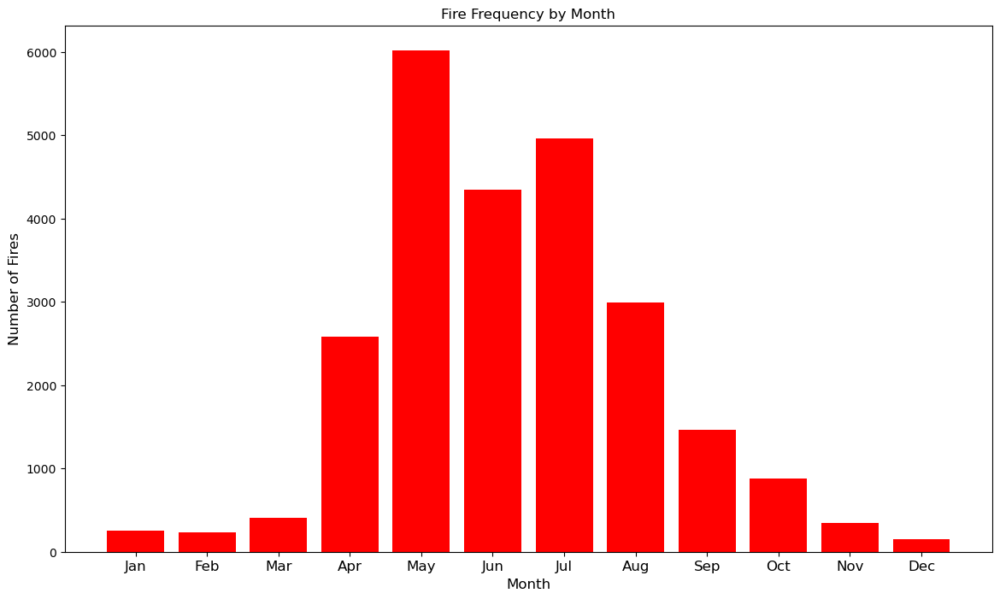

# Alberta-Wildfire-Analysis
# Group Member : Riya Chevli , Deepika Gollamandala , Yilin Wan . 
## Project Overview : 
Wildfires naturally occur in many ecosystems and play an important role in helping forests and grasslands regenerate by removing old plants. However, they can become harmful when they occur close to populated areas, where they can destroy homes, businesses, and even lead to injuries or loss of life. We chose to study wildfires because they are a complex issue with overarching and lasting impacts across the environment, ecology, and economy of communities, especially in this part of the world, as seen in the recent fires in California. News reports highlight that 2023 has been an especially severe year for wildfires in Canada. Recently, there has been a noticeable rise in both the frequency and intensity of these fires.

Alberta is no stranger to wildfires—the latest one being the devastating wildfire in Jasper during the summer of 2024, in which about 30% of the tourist town was destroyed by fire. Studying wildfires, their patterns, causes, and characteristics helps us understand them and find ways to prevent and mitigate them, keep communities safe, and protect the environment.

## Guiding questions : 
To thoroughly understand wildfires in Alberta, we formulated the following guiding questions. The insights gathered will contribute to the development of effective wildfire management strategies.
1. What are the primary causes for wildfires in Alberta?
2. Any differences in characteristics of wildfires started by natural causes vs. human activity?​
3. During which months are fires most frequent?
4. How do weather conditions affect the size and spread of wildfires?​
5. How does the type of trees affect the size and spread?
6. Any observable trends in the frequency or size of wildfires in Alberta over the years?

## Dataset : 
#### 1. Historical wildfire dataset
- Source: https://open.alberta.ca/opendata/wildfire-data
- Description: The dataset covers 17 years of wildfire data in Alberta (2006–2023). It includes details such as causes, size, location, time, duration, weather conditions, resources used, and the area burned [open.alberta.ca].
- Size: The dataset is stored in csv format and has 25322 rows and 50 variables in the dataset. 
- Format: CSV

### 2. Historical Air Quality Dataset
- source : https://data.calgary.ca/Environment/Average-Daily-Air-Parameter-Values/vi73-jiec
- Description : The dataset includes average air quality index data.
- size:The dataset is stored in csv format and has 26057 rows and 9 variables in the dataset.

## Project Implementation:
###  Part 1: Data Cleaning and Preprocessing  
  1.1  Load and Inspect the Datasets  
  - Load the dataset and display its shape, column names, and data types.
  - Identify and list the number of missing values in each column.
  - Check for duplicate rows and remove if found.
    
  1.2  Handling Missing Data  
  -  Drop columns with more than 35% missing values.
  -  We chose not to handle outliers to study the causes and characteristics of extreme fires. Missing values were filled using the K-Nearest Neighbors (KNN) algorithm, as discussed in class.
  -  Numeric columns were imputed with KNN, while missing values in categorical columns were replaced with the most frequent value.
  
### Part 2: Data Transformation and Analysis    
 2.1 Group and Aggregate:  
 - We split our data into three categories preCOVID, COVID and postCOVID and it groups the data by the general cause of the fire varaible(general_cause_desc).
 - Apply aggregate function for different varaible. Used mean and median for burned area (ex_hectares) and only mean used for fire spread rate ,temperature, relative humidity, and wind speed.
 - Create new column period which assign each row to one of three periods based on the fire_year column and group this column to ex_hectares and perform max , avg , total burned area opration.
 
 2.2 Joining Data  
 - Here we create pivot table to give us  Top 5 Most Frequent General Causes by Period.
 
### Part 3: Data Visualization
 3.1 Line chart and bar chart showing the monthly frequency of fires.
 
 
 3.2 Bar charts showing the frequency of general causes of wildfires.

 3.3 Stacked bar chart and box plots showing the differences in fire spread rates among the fires due to natural causes and fires due to human activity.
 
 3.4 Scatter plots and 3D Scatter Plot showing the influence of weather conditions on the size, spread and frequency of fires.

 3.5 Bar chart showing the impact of wildfires on air quality in Calgary.
 
 3.6 Pie charts showing the proportions of various class of fire - minimal impact, moderate impact, extensive impact, etc.
 
 
### Part 4: Further Analysis  
  4.1  Correlation Analysis   
  - we Compute and visualize the correlation matrix between Average Daily Value, current_size, fire_spread_rate, temperature, relative_humidity, and wind_speed.we Identify strong correlations and explain their implications.
    
  4.2  Hypothesis Testing  
  - We conducted hypothesis testing to compare three periods: pre-COVID, during COVID, and post-COVID. The results led us to reject the null hypothesis, indicating a significant difference in the mean burned area across these periods.
### Part 5: Reporting and Insights   
- We compiled our report using Python in Jupyter Notebook, providing an in-depth analysis of all insights. Each finding is supported by detailed visualizations to illustrate the trends and relationships clearly. Finally, the report concludes with actionable recommendations on reducing wildfires based on the analyzed data.

##  Tools & Technologies  
- Python (pandas, numpy, scikit-learn)
- Jupyter Notebooks for code and report
- Data visualization libraries (matplotlib, seaborn,plotly)
- Version control: GitHub
  
